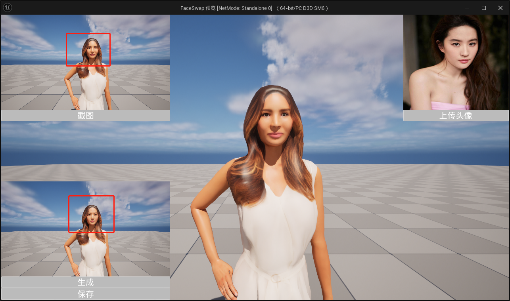
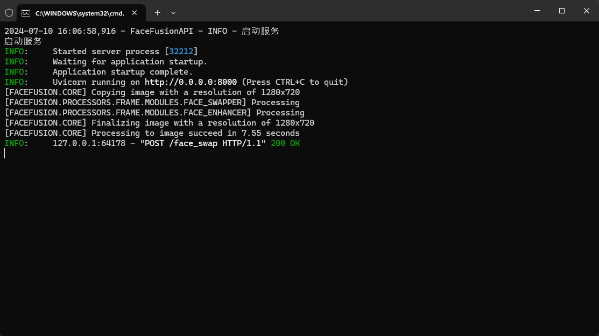

# FaceSwap4UE 技术文档

## 简介

在虚幻引擎中，场景里有一角色，上传一张自定义的头像图片，将上传的脸替换到场景里的角色上，并保存为图片。

本项目基于**FaceFusion**，项目地址 https://github.com/facefusion/facefusion

## 架构示意

 

ue客户端发送生成请求至FaceFusion后端，并回调结果。

**参数：**

- 参考头像
- 要替换的目标图片

**返回**

- 替换好的图片

## 运行要求

- **操作系统**：Windows 10 +
- **NVIDIA**显卡

## 后端部署

### 一、安装CUDA

#### 1、检查电脑的NVIDIA版本

首先先按 **Win键 + R键**，打开**Windows命令**运行框，并输入 **cmd**

回车（Enter）打开**Windows控制台命令**窗口，输入  **nvidia-smi**   回车得到以下窗口

 

这里的12.3就是驱动对应的**最高**版本，我们所安装的CUDA版本**小于等于**它即可

#### 2、下载所需CUDA版本

选择任意版本号**小于等于**上述最高版本的即可

CUDA下载官网 https://developer.nvidia.com/cuda-toolkit-archive

#### 3、CUDA安装

运行下载好的程序，等待安装即可完成

#### 4、检查是否成功安装

打开Windows控制台命令窗口，输入  **nvcc -V** （注意-前有空格）回车得到以下窗口

 

安装成功

### 二、安装cuDNN

#### 1、下载所需cuDNN版本

选择跟自己的cuda版本适配的cuDNN版本

cuDNN下载官网 https://developer.nvidia.com/rdp/cudnn-download

#### 2、配置环境变量

我们先把下载的 cuDNN 解压缩，会得到下面的文件

 

下载后发现其实cudnn不是一个exe文件，而是一个压缩包，解压后，有三个文件夹，把三个文件夹拷贝到cuda的安装目录下

CUDA 默认的安装路径如下

`C:\Program Files\NVIDIA GPU Computing Toolkit\CUDA\v10.1`

拷贝时看到，CUDA 的安装目录中，有和 cuDNN 解压缩后的同名文件夹，这里注意，不需要担心，直接复制即可。cuDNN 解压缩后的同名文件夹中的配置文件会添加到 CUDA安装目录中的同名文件夹中

cuDNN 其实是 CUDA 的一个补丁，专为深度学习运算进行优化的。

往系统环境变量中的 path 添加如下路径（根据自己的路径进行修改）

`C:\Program Files\NVIDIA GPU Computing Toolkit\CUDA\v10.1\bin`
`C:\Program Files\NVIDIA GPU Computing Toolkit\CUDA\v10.1\include`
`C:\Program Files\NVIDIA GPU Computing Toolkit\CUDA\v10.1\lib`
`C:\Program Files\NVIDIA GPU Computing Toolkit\CUDA\v10.1\libnvvp`

#### 3、验证配置是否成功

配置完成后，我们可以验证是否配置成功，主要使用CUDA内置的deviceQuery.exe 和 bandwidthTest.exe：

首先win+R启动cmd，cd到安装目录下的 …\extras\demo_suite

输入 `.\deviceQuery.exe` 命令，观察窗口输出结果。

继续输入 `.\bandwidthTest.exe` 命令，两条命令都出现 **`PASS`** 说明 `cudnn` 环境配置成功。

### 三、本地部署后端

将后端压缩包解压缩，任意路径均可以

 

双击运行`run_server.bat`，弹出下面窗口

 

后端部署完成

## 插件安装

### 安装要求

- **虚幻引擎版本**：Unreal Engine 5.3

- **操作系统**：Windows 10 +

  

接下来从以下两种可选方式安装

### 从IDE中进行源码构建

从IDE（VS、Rider）中进行源码构建请遵从以下步骤：

1. 在项目目录中创建`Plugins`文件夹
2. 将插件移动到Plugins目录下
3. 刷新解决方案
4. 启动编译

### 预编译

1. 在项目目录中创建`Plugins`文件夹
2. 将预编译好的插件移动到Plugins目录下
3. 启动项目

此时打开插件面板，可以看到FaceSwap4UE插件已启用

  

## 蓝图节点

### 总览

搜索 faceswap，出现以下函数

 

共分为五大类

- Capture：捕获截图
- Convert：转换
- File：读写
- File Dialog：选择文件
- Face Swap：换脸服务

### Face Swap

 

**Face Swap**节点为蓝图异步节点

| 输入引脚             | 类型     | 说明                                                         |
| -------------------- | :------- | ------------------------------------------------------------ |
| Url                  | 字符串   | FaceFusion服务器地址，不需要路由地址，连接地址 例如 http://127.0.0.1:8000，后面不带斜杠 |
| In Ref Image Data    | 字节数组 | 输入的头像二进制数据，注意是图像，不是Texture2D              |
| In Target Image Data | 字节数组 | 输入的目标图像二进制数据，注意是图像，不是Texture2D          |

| 输出引脚               | 类型     | 说明                                                         |
| ---------------------- | -------- | ------------------------------------------------------------ |
| On Progress            | 执行     | 正在生成                                                     |
| On Success             | 执行     | 生成成功                                                     |
| On Failure             | 执行     | 生成失败                                                     |
| Code                   | 整数     | 状态码，参考下面状态码说明                                   |
| Texture Raw Data Bytes | 字节数组 | 生成的图像二进制数据，可以存为png（服务器默认图像压缩格式）或是通过网络传输 |
| Message                | 字符串   | 处理消息                                                     |

| 状态码 | 含义                                                         | 说明                                             |
| ------ | ------------------------------------------------------------ | ------------------------------------------------ |
| 200    | 请求成功                                                     | 服务器正常完成请求                               |
| 201    | 请求已创建                                                   | 正在生成的时候会返回，表示服务器已接受并开始处理 |
| 400    | 请求参数错误，服务器拒绝处理                                 | 通常为客户端的图像参数有误，例如图像为空         |
| 404    | 无法找到服务器                                               | 服务器不在线或客户端断网                         |
| 500    | 服务器内部错误，无法完成请求                                 | 生成出错了                                       |
| 502    | 作为网关或代理角色的服务器，从上游服务器中接收到的响应是无效的 | 代理服务器例如Nginx正常响应，但FaceFusion不在线  |
| 其他   | 网络上查资料                                                 |                                                  |

### Capture

#### Async Capture Texture2D

 

**Async Capture Texture2D**节点为蓝图异步节点

**不会捕获UI**，图像分辨率为当前视口分辨率

| 输出引脚         | 类型      | 说明                 |
| ---------------- | --------- | -------------------- |
| On Success       | 执行      | 截图成功             |
| On Fail          | 执行      | 截图失败             |
| Out Texture      | Texture2D | 截图的纹理2D         |
| Out Binary Image | 字节数组  | 截图的图像二进制数据 |

### Convert

#### Binary Image to Texture 2D

 

工具函数，用于转换二进制图像到Texture2D，支持常见的图像格式，png、jpg、bmp等

| 输入引脚     | 类型     | 说明           |
| ------------ | -------- | -------------- |
| Binary Image | 字节数组 | 图像二进制数据 |

| 输出引脚  | 类型      | 说明         |
| --------- | --------- | ------------ |
| Texture2D | Texture2D | 转换后的纹理 |

### File

#### Load File to Bytes

 

工具函数，加载本地的文件到字节数组

| 输入引脚  | 类型   | 说明     |
| --------- | ------ | -------- |
| File Path | 字符串 | 文件路径 |

| 输出引脚 | 类型     | 说明                           |
| -------- | -------- | ------------------------------ |
| Success  | 布尔     | 是否成功，文件不存在时会返回假 |
| Out Data | 字节数组 | 二进制数据                     |

#### Save Bytes to File

 

工具函数，保存字节数组到本地的文件，可覆盖

| 输入引脚     | 类型     | 说明             |
| ------------ | -------- | ---------------- |
| File Path    | 字符串   | 要保存的文件路径 |
| In File Data | 字节数组 | 二进制数据       |

| 输出引脚     | 类型 | 说明     |
| ------------ | ---- | -------- |
| Return Value | 布尔 | 是否成功 |

### File Dialog

#### Open Image File Dialog

 

打开图像文件选择对话框（仅运行时）

支持png、jpg、bmp等格式

| 输入引脚     | 类型   | 说明     |
| ------------ | ------ | -------- |
| Default Path | 字符串 | 默认路径 |

| 输出引脚     | 类型   | 说明                         |
| ------------ | ------ | ---------------------------- |
| File Path    | 字符串 | 选择的文件路径               |
| Return Value | 布尔   | 是否已选择，如果取消就返回假 |

#### Save Image File Dialog

 

保存文件选择框（仅运行时）

该节点只保存PNG格式图像（FaceFusion服务器默认图像压缩格式）

| 输入引脚          | 类型   | 说明                     |
| ----------------- | ------ | ------------------------ |
| Default Path      | 字符串 | 默认路径                 |
| Default File Name | 字符串 | 默认文件名（不带扩展名） |

| 输出引脚     | 类型   | 说明                         |
| ------------ | ------ | ---------------------------- |
| File Path    | 字符串 | 保存的文件路径               |
| Return Value | 布尔   | 是否已保存，如果取消就返回假 |

## 示例

下面演示使用以上蓝图节点组合的最小示例

### DEMO演示

#### 前提条件

- **FaceFusion**后端服务已运行（参考上面提到的后端部署进行配置）

#### 运行演示

进入插件内容，打开**Map_Demo**关卡，运行

 

按照以下步骤操作

 

结果如下，人脸已更换

 

此时**FaceFusion**后端控制台如下

 

#### 蓝图示例

打开蓝图示例 **WBP_Main**

 

蓝图示例如下

 

### 场景截图

 

### 上传头像

  

### 换脸

**换脸所使用的字节数组为图像二进制数据**

### 保存结果图像

 

